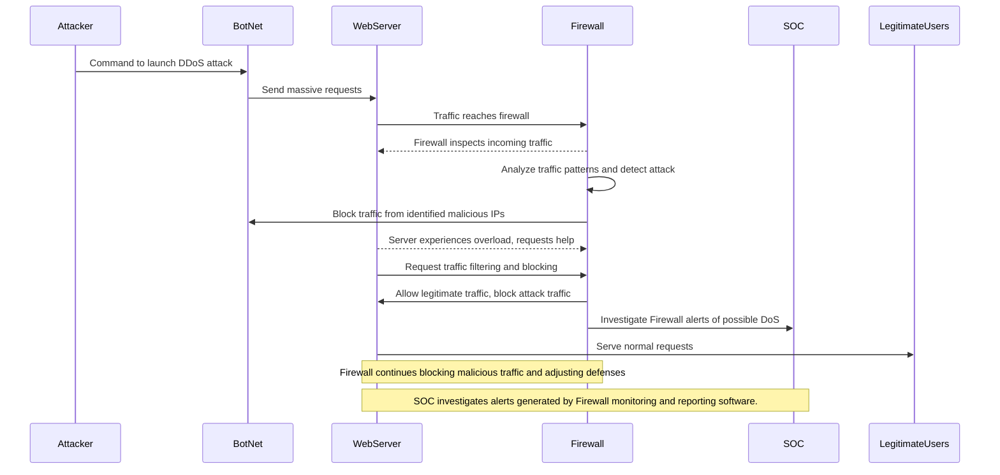

# DDoS Attack Sequence Diagram

Steps:
1. Attacker sends a command to the BotNet to initiate the DDoS attack.
2. The BotNet sends massive requests to the WebServer, attempting to overwhelm its resources.
3. The WebServer's incoming traffic reaches the Firewall, which is the first line of defense.
4. The Firewall inspects the incoming traffic to identify any malicious patterns.
5. After analyzing the traffic, the Firewall detects the attack and blocks traffic from the identified malicious IPs.
6. The WebServer experiences an overload due to the DDoS attack and requests help from the Firewall.
7. The Firewall responds by allowing legitimate traffic while blocking the attack traffic from the BotNet.
8. The Firewall sends an alert to the SOC (Security Operations Center) to investigate potential issues and responses.
9. The WebServer serves normal requests from legitimate users while the Firewall continues blocking malicious traffic.

Measures Taken:
1. Traffic filtering by firewall
    > Firewall anaylzes incoming traffic, detecting known malicious web traffic/patterns/bot nets. Blocking malicious attacks as well as blocking web traffic based on configured changes and vendor support.
2. Overload Detection 
    > Webserver detects overload and requests help from Firewall as some rules may alert the firewall of possible DoS attack due to amount of traffic and timeframe.
3. Selective Traffic Allowance 
    > The Firewall allows traffic through to the Webserver while blocking attack traffic from the BotNet or malicious actors.
4.SOC Investigation
    > The SOC receives alerts from the Firewall, investigates and refines defense strategies to further migigate DoS attacks.
